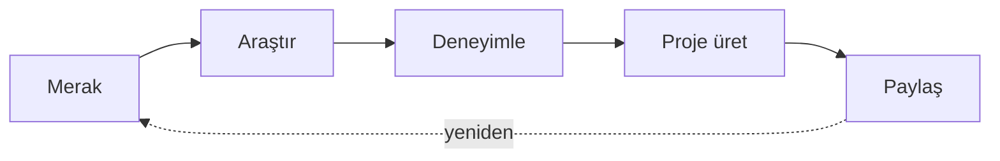

<div align="center">


<br>

<h1>Talha <code>// BamBam</code></h1>

<p><i>Fikirleri keşfediyor, deneyimliyor ve çalışan projelere dönüştürüyorum.</i></p>

<br>

<p>
  
  
  
</p>

</div>

---

## ◈ Hakkımda

```text
Merhaba! Ben Talha.

Yazılım dünyasını keşfediyor, öğrendiklerimi küçük projelere
dönüştürüyor ve her yeni commit ile kendimi geliştiriyorum.

Bu profil tamamlanmış bir vitrin değil;
gelişim sürecimin canlı kaydı.
```

## ◈ Üretim Döngüm



## ◈ Yol Haritası

| Durum | Görev |
|:---:|---|
| 🟢 **ACTIVE** | Yeni teknolojiler öğreniyorum |
| 🟢 **ACTIVE** | İlk açık kaynak projelerimi hazırlıyorum |
| 🔵 **NEXT** | Projelerimi düzenli olarak GitHub'da paylaşacağım |
| 🟣 **GOAL** | Her projede bir öncekinden daha iyi kod yazmak |

## ◈ GitHub Aktivitesi

<div align="center">


<br>


</div>

## ◈ Bağlantı

Benimle iletişim kurmanın en kolay yolu GitHub üzerinden ulaşmak:

[](https://github.com/talhaselcukk)

---

<div align="center">

```text
SYSTEM MESSAGE: Henüz yolun başındayım — ama ilerleme kaydediliyor.
```

<sub>Sonraki güncelleme: yeni bir şey öğrendiğimde.</sub>

</div>
